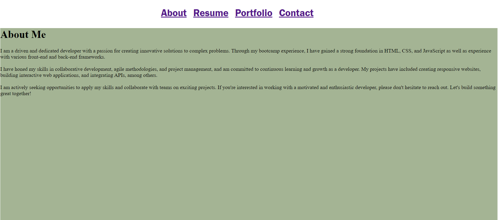

# react-portfolio

## Description
This is a simple portfolio website built with React. The purpose of this website is to showcase your skills and projects to potential employers or clients. The website has four main pages: About, Portfolio, Resume, and Contact.

About: Provides detailed information about your background, education, and work experience.
Portfolio: Showcases some of your recent projects, including descriptions and links to their repositories and live demos.
Resume: Provides a link of your resume that visitors can download.
Contact: Provides a form for visitors to send you a message or inquiry.

You can navigate between these pages using the navigation bar at the top of the page.

## Installation
To install the website, follow these steps:

Clone the repository to your local machine using git clone.
Navigate to the project directory in your terminal or command prompt.
Run npm install to install the necessary dependencies.

## Usage
To run the website, follow these steps:

In the project directory, run npm start to start the development server.
Open your web browser and navigate to http://localhost:3000 to view the website.
You can modify the content of the pages and components, as well as the stylesheets and other assets to customize the website for your own use. The website is built using React, with components organized in the src/components directory. The pages are implemented as top-level components in the src/pages directory.

You can modify the stylesheets using the CSS files in the src directory. 

## Deployment
To deploy the website to a live server, you can use a service such as Netlify or Heroku. Create a new project on the service and link it to your GitHub repository. The service will automatically build and deploy the website whenever you push changes to the repository.

## Credits
The website uses various open-source libraries and assets, including React.

## License
This project is licensed under the MIT License.

## Visual
